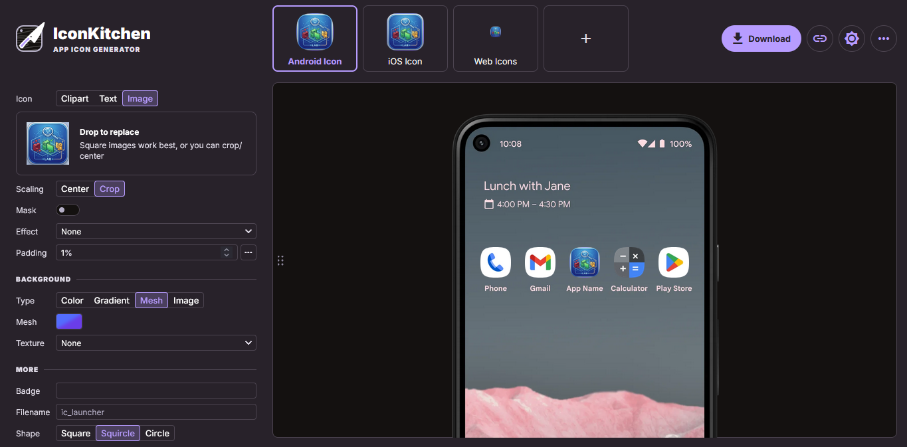

# PROYECTO FINAL: TechAudit 2.0
**Escenario del Proyecto**

La empresa **TechSolutions** requiere una mejora en su sistema de auditoría tecnológica.
En la versión anterior del sistema únicamente era posible registrar equipos informáticos de forma independiente, lo que dificultaba la organización de la información.
Para resolver este problema, se desarrolló la aplicación **TechAudit 2.0**, cuyo objetivo es permitir una organización lógica de los equipos mediante laboratorios.

---
## Logo de la App

---

## Creación de Icono para App

> Se creo los Iconos para la App en esta pagina web: https://icon.kitchen/

